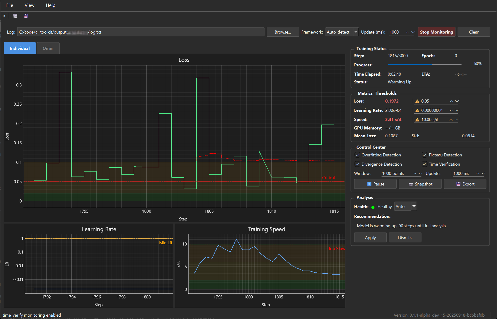

# AI Training Monitor

[](https://python.org)
[](LICENSE)
[](https://github.com)
[](https://github.com/djdarcy/ai-training-monitor)

Universal AI training monitor with real-time graphs like Process Explorer - monitor any AI/ML training framework with smooth, professional visualizations.

**⚠️ Alpha Software**: This tool is in early development. See [Current Status](#current-status) for known issues.

## Overview

AI Training Monitor is a native desktop application that provides real-time visualization of AI/ML training metrics. Similar to [Process Explorer](https://learn.microsoft.com/en-us/sysinternals/downloads/process-explorer) but designed specifically for monitoring training progress, it offers smooth graphs, automatic pattern detection, and a plugin architecture that supports any training framework.



## Features

- **Universal Plugin Architecture** - Works with any training framework through extensible parsers
- **Real-time Smooth Graphs** - 60 FPS visualization using PyQtGraph (not terminal-based)
- **Intelligent Analysis** - Automatic detection of overfitting, plateaus, and divergence
- **Professional Native UI** - Desktop application with Process Explorer-style interface
- **Multi-Metric Tracking** - Monitor loss, learning rate, speed, memory usage simultaneously
- **Framework Support** - Ostris, Kohya_ss, HuggingFace, PyTorch Lightning, and more
- **Export Options** - Save graphs as images, export data as CSV
- ️**Cross-Platform** - Works on Windows, Linux, and macOS

## Installation

```bash
# Clone the repository
git clone https://github.com/yourusername/ai-training-monitor.git
cd ai-training-monitor

# Install dependencies
pip install -r requirements.txt

# Or install in development mode
pip install -e .
```

## Usage

```bash
# Auto-detect framework and monitor
python -m ai_training_monitor /path/to/training/output

# Specify framework explicitly
python -m ai_training_monitor --framework ostris /path/to/output/character

# Monitor specific log file
python -m ai_training_monitor --log /path/to/log.txt --framework kohya
```

## Current Status

### What Works
- **Individual Graphs View**: Three separate graphs for Loss, Learning Rate, and Speed with proper scaling
- **Threshold Overlays**: Dynamic colored zones and threshold lines that adapt to your hardware
- **Interactive Control Panel**: Adjust thresholds, toggle monitoring features, pause/resume
- **Pattern Detection**: Automatic detection of overfitting, plateaus, and divergence
- **Parser Support**: Fully functional Ostris AI Toolkit parser
- **Export Functions**: Save data as CSV for further analysis

### Known Issues
- **OmniGraph Axis Scaling**: The unified "Omni" view doesn't properly update Y-axis numeric values when switching primary metrics (shows 0-1 instead of actual values)
- **Time Verification**: "Space invader blip" visualization not yet implemented
- **Historical Data Loading**: Toggle for loading past vs current-only data not yet available
- **Limited Parser Support**: Currently only Ostris format is fully implemented

### Roadmap
- Fix OmniGraph axis scaling issue (mostly working)
- Add historical data loading with toggle
- Implement time verification visualization
- Add support for Kohya_ss, HuggingFace Trainer, PyTorch Lightning
- Add data export and session management
- Improve real-time performance for very long training runs

## Contributions
Contributions are welcome! Please read our [Contributing Guide](CONTRIBUTING.md) for details on how to contribute.

Like the project?

[](https://www.buymeacoffee.com/djdarcy)

## License

AI Training Monitor, Copyright (C) 2025-2026 Dustin Darcy

This project is licensed under the MIT License - see [LICENSE](LICENSE) for details.

## Acknowledgements

- **[Ostris AI Toolkit](https://github.com/ostris/ai-toolkit)** - Primary training framework that inspired this monitor's initial parser implementation
- **[PyQt6](https://www.riverbankcomputing.com/software/pyqt/)** - Python bindings for Qt6, providing the native GUI framework
- **[PyQtGraph](https://www.pyqtgraph.org/)** - High-performance real-time graphing library built on PyQt
